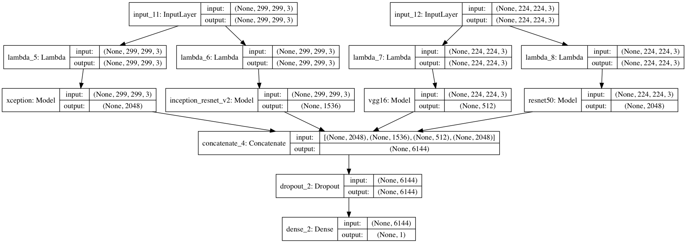

# CatVSDog
Udacity ML Capstone Project

[数据集可以在 Kaggle 上获得](https://www.kaggle.com/c/dogs-vs-cats-redux-kernels-edition)

* 混合模型1

* 混合模型2

#### 环境要求
keras version = 2.1.5
numpy version = 1.14.2
tensorflow version = 1.6.0

#### 预估训练时间
以 AWS P3 实例为参考
单模型 < 15 min
微调 < 10 min
特征融合 < 20 min
结构融合 < 30 min
图像增强 < 25 min

#### 最终结果
|  Model  |  LogLoss  |  Rank  |
|:-------|:------------- | ----------:|
|  Xception  |    0.08306  |	>250 |
|  VGG16  |     0.06959  |	 <166  |
| InceptionResNetV2 |	0.07800  |	>200 |
| 微调 VGG16|	0.06095	| <130 |
| ResNet50、Xception、InceptionV3、InceptionResNetV2特征融合 |	0.03712	| <7 |
| ResNet50、Xception、InceptionV3、InceptionResNetV2结构融合 |	0.04966	| <59 |
| ResNet50、Xception、VGG16、InceptionResNetV2结构融合	| 0.04564 |<34 |
| 图像增强 VGG16	| 0.06450	| <142 |
